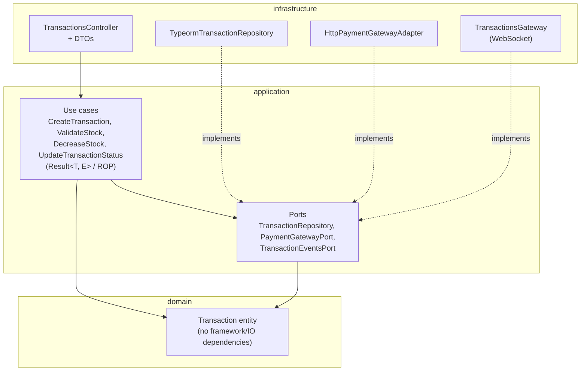
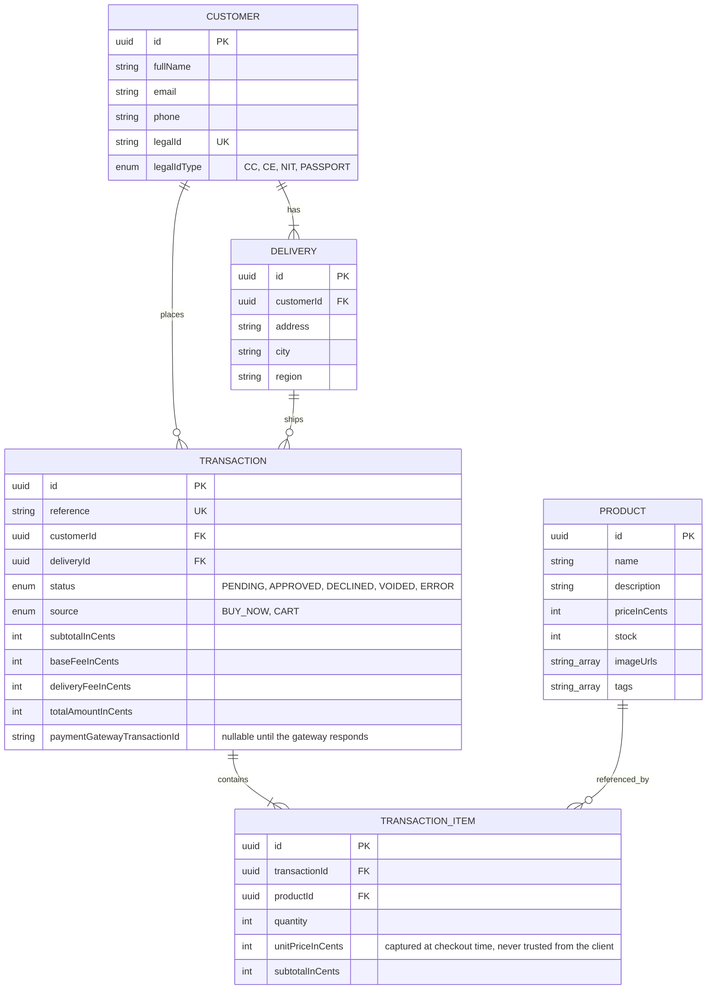

# Checkout Flow App

A checkout application where customers browse a product catalog, add items to a cart, pay by credit card through a third-party payment gateway, and track the resulting transaction. Stock and delivery data update once the payment is resolved.

## Table of contents

- [Overview](#overview)
- [Tech stack](#tech-stack)
- [Monorepo structure](#monorepo-structure)
- [Architecture](#architecture)
- [Data model](#data-model)
- [API documentation](#api-documentation)
- [Security](#security)
- [Getting started](#getting-started)
- [Environment variables](#environment-variables)
- [Testing](#testing)
- [Deployment](#deployment)

## Overview

The app follows a 5-step checkout flow:

1. **Product catalog**: browse available products and stock.
2. **Card & delivery info**: enter (fake, but structurally valid) credit card data and delivery details.
3. **Summary**: review product subtotal, base fee, and delivery fee before confirming.
4. **Payment result**: the transaction is created as `PENDING` and sent to the payment gateway. Once the gateway resolves it, it calls the API back with a signed webhook, and the backend pushes the final status to the frontend over a websocket.
5. **Back to catalog**: redirect to the product catalog with stock already updated.

The cart supports multiple products and quantities in a single transaction, not just a single-item checkout. There are two entry points: **buy now** from a product page (one SKU, one or more units), and the **cart** (multiple products, added while continuing to browse). Both produce the same `POST /transactions` request shape (`items: [{ productId, quantity }]`). `TRANSACTION.source` records which entry point was used, for informational purposes only; it never changes backend logic.

## Tech stack

| Layer | Stack |
|---|---|
| Frontend | React 19 + TypeScript + Vite, Redux (Flux architecture), Tailwind CSS v4 |
| Backend | NestJS + TypeScript, Hexagonal Architecture (Ports & Adapters), Railway-Oriented Programming for use cases |
| Database | PostgreSQL (ORM: TypeORM) |
| Payments | Payment gateway API (sandbox) |
| Infrastructure | Terraform on AWS (ECS on Fargate + ALB, VPC, RDS, ECR, S3, CloudFront) |
| CI/CD | GitHub Actions |

## Monorepo structure

```
checkout-flow-app/
├── backend/          NestJS API
├── frontend/         React SPA
├── infrastructure/   Terraform (AWS)
└── .github/          CI/CD workflows
```

Each app is independent (own `package.json`/lockfile). GitHub Actions triggers per-app pipelines using path filters; see `.github/workflows/`.

## Architecture

- **Backend**: business logic lives outside the controller layer (Hexagonal Architecture / Ports & Adapters). Use cases follow a Railway-Oriented Programming style, so each step (validate stock, create transaction, call payment gateway, update stock) can fail explicitly without exceptions driving control flow.
- **Frontend**: state managed via Redux following Flux principles. Checkout progress (cart, card/delivery form, transaction reference) is persisted to `localStorage` so the app recovers on refresh.

The backend's `domain` / `application` / `infrastructure` layers are implemented throughout (see [`docs/diagrams/`](docs/diagrams/) for the deployed-infrastructure and pipeline diagrams). Dependencies point inward: `infrastructure` implements the ports `application` declares, and `application` depends only on `domain`. The example below is the `transactions` module; the other three follow the same shape.



The other three modules follow the same layering, with only a repository port (no external gateway or event port):

| Module | Domain entity | Application ports | Infrastructure adapter |
|---|---|---|---|
| `products` | `Product` | `ProductRepository` | `TypeormProductRepository` |
| `customers` | `Customer` | `CustomerRepository` | `TypeormCustomerRepository` |
| `deliveries` | `Delivery` | `DeliveryRepository` | `TypeormDeliveryRepository` |

### Local development topology


Frontend, backend, PostgreSQL, and MinIO all run as containers in Docker Compose; only the browser itself isn't containerized. MinIO is a real, active S3-compatible store. It holds a public-read `product-images` bucket (a bag photo and a beans photo per product), and the browser fetches images from it directly on its host-mapped port. The backend never touches image bytes; it only knows the base URL (`PRODUCT_IMAGES_BASE_URL`) to compose `imageUrls` strings with at seed time. No card data is ever persisted locally: the only calls that leave the machine are card tokenization (browser to payment gateway, public key), transaction creation (API to payment gateway, private key), and the payment gateway's webhook calling back with the final transaction status. That webhook has to be simulated manually here (a correctly-signed POST to `/transactions/webhook`), since the payment gateway's sandbox can't reach `localhost`.

See [Deployment](#deployment) for the CI/CD pipeline diagram.

### Production topology — AWS

There's no custom domain. Each CloudFront distribution serves on its own default `*.cloudfront.net` hostname, which already carries a fully valid, trusted certificate with zero ACM/Route 53 setup. A custom domain would only have bought a nicer-looking URL, at the cost of a Route 53 hosted zone, ACM DNS validation, and delegating a subdomain of a personal domain.

- Frontend: https://d1vdwx1cui511h.cloudfront.net
- API: https://d3m7few5u96zzk.cloudfront.net

![Production AWS architecture: two CloudFront distributions (app and api) on their default domains, the app distribution split by path into two S3 origins (the static site and product images), ECS on Fargate and RDS inside a VPC split into public and private subnets, with an ALB and NAT Gateway in the public subnet, ECR receiving pushed images from CI/CD, Secrets Manager holding DB and payment-gateway credentials, and the browser and backend both reaching the external payment gateway sandbox API — including its webhook calling back into the api CloudFront distribution](docs/diagrams/production-aws.svg)

The api distribution sits in front of the ALB to get free HTTPS at the edge without owning more infrastructure. It also proxies the websocket the backend pushes live transaction status updates over, forwarding the `Upgrade`/`Connection` headers via CloudFront's managed `AllViewer` origin request policy. The ALB itself listens on plain HTTP; CloudFront to ALB stays inside AWS's network, so no extra certificate is needed there, while the browser-facing hop stays HTTPS end to end via CloudFront. ECS (Fargate) and RDS live in the VPC's private subnet, single-AZ; only the ALB and NAT Gateway sit in the public one. The ALB's security group accepts traffic only from CloudFront's managed prefix list, never directly from the internet.

The app distribution serves two S3 origins by path: the default path (`/*`) goes to the static site bucket (the Vite build), and `/product-images/*` goes to a separate `product-images` bucket (uploaded manually, key-prefixed to match the path pattern). Both sit behind the same distribution's Origin Access Control, so neither bucket is ever publicly reachable except through CloudFront.

### Why ECS/Fargate instead of App Runner

The infra could have shipped on App Runner, a fully managed alternative that bundles load balancing, TLS termination, and autoscaling without building any of it by hand. This project uses **ECS on Fargate with a self-managed VPC and ALB** instead, deliberately:

- The brief's own suggested AWS services are Lambda, ECS, and EKS; App Runner isn't among them, and demonstrating hands-on VPC/ALB/security-group design is part of what this deploy is meant to show.
- It's a deliberate trade-off: building the full networking stack by hand (public/private subnets, Internet Gateway, NAT Gateway, ALB, target groups, security groups) that App Runner would have hidden entirely.
- It costs more to run than App Runner would have. ALB and NAT Gateway have no free tier, roughly $48-50/month combined if left running continuously; that's an accepted cost given the brief only recommends the free tier, it doesn't require it.

If this were optimizing purely for lowest cost and least infrastructure to maintain, App Runner would be the better call.

## Data model



No card data (PAN, CVV, expiry) is ever persisted; card details are handled directly between the frontend and the payment gateway.

`imageUrls` is a small ordered gallery (today: one bag photo, one beans photo). Each entry is either a relative path resolved against whatever origin the frontend is on (product-images bucket, via CloudFront in production or MinIO locally) or an absolute external URL; the frontend doesn't care which, it just renders whatever's in the array. `tags` are freeform display labels (origin, roast level). `Product` itself stays category-agnostic; it isn't coupled to coffee specifically.

## API documentation

Swagger UI is wired up via `@nestjs/swagger` (`backend/src/main.ts`) and served at `/api/docs`:

- Local: https://localhost:3000/api/docs
- Production: https://d3m7few5u96zzk.cloudfront.net/api/docs

Required resources: `stock`, `transactions`, `customers`, `deliveries`, each exposed as its own controller/endpoint group, not flattened into a generic products CRUD. All controllers and DTOs are decorated with `@ApiTags`/`@ApiProperty`, so the generated spec is descriptive.

## Security

Reviewed against the [OWASP Top 10:2025](https://owasp.org/Top10/2025/):

- **A02 Security Misconfiguration**: `helmet` (security headers), explicit CORS allowlist, HTTPS locally via mkcert, generic error messages on 5xx (full detail logged server-side only).
- **A03 Software Supply Chain Failures**: `npm audit --audit-level=high` in CI, CodeQL static analysis (`.github/workflows/codeql.yml`), lockfile committed.
- **A04 Cryptographic Failures**: card data is tokenized client-side and never reaches this backend; payment gateway requests and webhook events are signed/verified using the gateway's own SHA-256 scheme.
- **A05 Injection**: all queries go through TypeORM's parameterized query builder; no raw SQL string concatenation anywhere.
- **A06 Insecure Design**: Hexagonal Architecture, Railway-Oriented Programming, and checkout writes (customer, delivery, transaction, stock) committed as one atomic DB transaction with automatic rollback on any step's failure.
- **A08 Software/Data Integrity Failures**: the payment gateway's webhook is signature-verified and rejects stale/replayed events (5-minute freshness window).
- **A09 Security Logging and Alerting Failures**: every use case logs its notable outcomes (creation, not-found, validation failures) plus dedicated security events (invalid webhook signatures, rate-limit trips). See [Known limitations](#known-limitations) for the alerting gap.
- **A10 Mishandling of Exceptional Conditions**: a single global exception filter normalizes every error response; Railway-Oriented Programming makes expected failures explicit `Result` values instead of thrown exceptions throughout the domain/application layers.

Also: rate limiting (`@nestjs/throttler`, 100 req/min per IP globally, 10 req/min on `POST /transactions`).

### Known limitations

- **A01 Broken Access Control**: there is no user login in this flow (guest checkout, per the test brief), so `GET /transactions/:id` and `GET /customers/:id` don't verify the caller owns the record; anyone holding the (random, unguessable) UUID can read it. A proportionate fix without adding user accounts would be requiring a second confirmation value (e.g. the customer's email) to match before returning data, similar to airline booking lookups. Not implemented yet.
- **A09 alerting**: security-relevant log lines exist (see above) and now land durably in CloudWatch Logs, since the backend is deployed. What's still missing is anyone getting notified when they fire: the plan is a CloudWatch Logs metric filter and alarm (e.g. on repeated invalid-webhook-signature or rate-limit-exceeded lines) wired to an SNS topic. Not implemented yet.

## Getting started

### Local (Docker Compose — recommended)

Requires [mkcert](https://github.com/FiloSottile/mkcert) installed (`brew install mkcert`). The frontend and backend both run over HTTPS locally with a certificate mkcert generates and trusts for you, so there's no browser TLS warning and no mixed-content surprises when the app talks to the payment gateway.

```bash
cp .env.example .env   # fill in your payment gateway sandbox keys
./run.sh                # generates local certs via mkcert, then docker compose up --build
```

- Frontend: https://localhost:5173
- Backend: https://localhost:3000
- MinIO console: http://localhost:9003 (not served over HTTPS, dev-only tooling)

This runs the topology described in [Local development topology](#local-development-topology) above: frontend, backend, Postgres, and MinIO all as containers, with source bind-mounted for hot reload on both frontend and backend. Certs live in `certs/` (gitignored, regenerated per machine by `run.sh`).

### Without Docker

<details>
<summary>Run each app natively instead (requires your own local Postgres and an S3-compatible store)</summary>

```bash
cd backend
npm install
npm run start:dev
```

```bash
cd frontend
npm install
npm run dev
```

</details>

### Infrastructure

One-time only, before the first `terraform init` below can succeed. This creates the S3 bucket and DynamoDB table the main config's remote state lives in:

```bash
cd infrastructure/bootstrap
terraform init
terraform apply
```

Then, from `infrastructure/`:

```bash
cd infrastructure
terraform init
terraform apply
```

This is live: it provisions the VPC/ALB/ECS/RDS stack plus both CloudFront distributions (app and product images) on their default `*.cloudfront.net` domains. There's no custom domain, so no Route 53/ACM step. Two manual steps after the first apply:

1. Set GitHub repo secrets so `deploy-backend.yml`/`deploy-frontend.yml` can run. `AWS_DEPLOY_ROLE_ARN`, `ECS_CLUSTER`, `ECS_SERVICE`, `FRONTEND_BUCKET`, `CLOUDFRONT_DISTRIBUTION_ID`, and `BACKEND_URL` come straight from the Terraform outputs; `VITE_API_BASE_URL`, `VITE_PAYMENT_GATEWAY_PUBLIC_KEY`, and `VITE_PAYMENT_GATEWAY_API_URL` are the same values used in the frontend's own `.env` (Vite inlines them at build time, so they can't be read from Secrets Manager at runtime).
2. Replace the placeholder secret value in Secrets Manager (`checkout-flow/payment-gateway`) with the real payment gateway sandbox keys. Terraform creates it with `lifecycle { ignore_changes = [secret_string] }`, so this survives future applies.

`cors_origin` and `product_images_base_url` are hardcoded Terraform variable defaults (the real CloudFront domains), not `terraform.tfvars` overrides. A `terraform.tfvars` is gitignored and doesn't reach CI, which previously caused a pipeline-driven apply to silently reset `CORS_ORIGIN` back to a `localhost` default and break the deployed frontend.

## Environment variables

See [`.env.example`](.env.example) at the repo root; copy it to `.env` before running `docker compose up`. It covers Postgres credentials, MinIO credentials, and payment gateway sandbox keys (`PAYMENT_GATEWAY_API_URL`, `PAYMENT_GATEWAY_PUBLIC_KEY`, `PAYMENT_GATEWAY_PRIVATE_KEY`, `PAYMENT_GATEWAY_EVENTS_KEY`, `PAYMENT_GATEWAY_INTEGRITY_KEY`).

## Testing

Both apps run Jest with an enforced 80% coverage threshold (branches/functions/lines/statements). `test:cov` exits non-zero below it, and `ci.yml` runs `test:cov` on every PR into `dev`, so a feature branch that doesn't add tests fails CI rather than merging quietly under-covered.

```bash
cd backend && npm run test:cov
cd frontend && npm run test:cov
```

Current coverage (statements/branches/functions/lines): backend 98.6% / 83.6% / 94.6% / 98.6% (165 tests across 46 suites), frontend 96.7% / 91.8% / 95.5% / 97.0%.

**Branch policy**: only `feature/*`, `fix/*`, and `chore/*` branches may merge into `dev` (enforced by the `branch-name` job in `ci.yml`). Direct pushes to `dev`/`prod` and PRs from other branch names should be blocked once branch protection is configured on GitHub; `ci.yml` alone can't block a merge, it can only fail the check that protection then blocks on.

## Deployment

- Frontend: https://d1vdwx1cui511h.cloudfront.net
- API: https://d3m7few5u96zzk.cloudfront.net

Infrastructure (VPC, RDS, ECS/Fargate, ALB, both CloudFront distributions) is applied and live, and the app itself is deployed to it: `deploy-backend.yml`/`deploy-frontend.yml` run on every merge into `prod`. See `infrastructure/` for the Terraform and the workflow files under `.github/workflows/` for the deploy pipelines themselves.

![CI/CD pipeline: feature/fix/chore branches merge into dev via PR (branch-name check, ci.yml's backend/frontend/infra jobs, codeql.yml), dev merges into prod via PR (branch-name check restricting the source to dev only), and a push to prod fans out into three independently-triggerable deploy workflows — deploy-infra.yml (terraform apply), deploy-backend.yml (build, push to ECR, redeploy ECS, wait for stability, OWASP ZAP scan), and deploy-frontend.yml (build, sync to S3, invalidate CloudFront) — all authenticating via a shared GitHub OIDC role, plus a separate manual-only destroy-infra.yml gated behind a typed confirmation](docs/diagrams/ci-cd-pipeline.svg)
