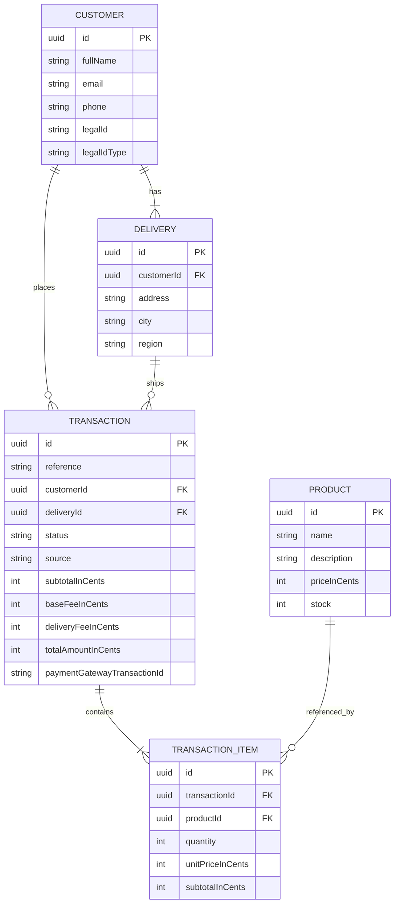

# Checkout Flow App

A checkout application where customers browse a product catalog, add items to a cart, pay by credit card through a third-party payment gateway, and track the resulting transaction — with stock and delivery data updated once the payment is resolved.

> **Status:** in active development. Sections marked `TODO` will be filled in as the corresponding piece is implemented.

## Table of contents

- [Overview](#overview)
- [Tech stack](#tech-stack)
- [Monorepo structure](#monorepo-structure)
- [Architecture](#architecture)
- [Data model](#data-model)
- [API documentation](#api-documentation)
- [Security](#security)
- [Getting started](#getting-started)
- [Environment variables](#environment-variables)
- [Testing](#testing)
- [Deployment](#deployment)

## Overview

The app follows a 5-step checkout flow:

1. **Product catalog** — browse available products and stock.
2. **Card & delivery info** — enter (fake, but structurally valid) credit card data and delivery details.
3. **Summary** — review product subtotal, base fee and delivery fee before confirming.
4. **Payment result** — transaction is created as `PENDING`, sent to the payment gateway, and the outcome is shown once resolved via a webhook the gateway calls back with the final status.
5. **Back to catalog** — redirect to the product catalog with stock already updated.

The cart supports multiple products and quantities in a single transaction (not a single-item checkout). There are two entry points into checkout — **buy now** from a product page (one SKU, one or more units) and the **cart** (multiple products, added while continuing to browse) — both produce the same `POST /transactions` request shape (`items: [{ productId, quantity }]`); `TRANSACTION.source` records which entry point was used for informational purposes only, it never changes backend logic.

## Tech stack

| Layer | Stack |
|---|---|
| Frontend | React 19 + TypeScript + Vite, Redux (Flux architecture), Tailwind CSS v4 |
| Backend | NestJS + TypeScript, Hexagonal Architecture (Ports & Adapters), Railway-Oriented Programming for use cases |
| Database | PostgreSQL (ORM: `TODO`) |
| Payments | Payment gateway API (sandbox) |
| Infrastructure | Terraform on AWS (ECS on Fargate + ALB, VPC, RDS, ECR, S3, CloudFront) |
| CI/CD | GitHub Actions |

## Monorepo structure

```
checkout-flow-app/
├── backend/          NestJS API
├── frontend/         React SPA
├── infrastructure/   Terraform (AWS)
└── .github/          CI/CD workflows
```

Each app is independent (own `package.json`/lockfile). GitHub Actions triggers per-app pipelines using path filters — see `.github/workflows/`.

## Architecture

- **Backend** — business logic lives outside the controller layer (Hexagonal Architecture / Ports & Adapters). Use cases are implemented with a Railway-Oriented Programming style, so each step (validate stock, create transaction, call payment gateway, update stock) can fail explicitly without exceptions driving control flow.
- **Frontend** — state managed via Redux following Flux principles. Checkout progress (cart, card/delivery form, transaction reference) is persisted to `localStorage` so the app recovers on refresh.

`TODO`: expand with a diagram once the layer boundaries are implemented (`domain` / `application` / `infrastructure` on the backend).

### Local development topology


Frontend, backend, PostgreSQL, and MinIO (a local S3-compatible store standing in for the product-images bucket) all run as containers in Docker Compose — only the browser itself isn't containerized. The only calls that leave the machine are card tokenization (browser → payment gateway, public key), transaction creation (API → payment gateway, private key), and the payment gateway's webhook calling back into the API with the final transaction status — no card data is ever persisted locally.

`TODO`: add the CI/CD diagram and the `docker-compose.yml` once implemented.

### Production topology — AWS

`TODO`: domain not finalized yet. Diagrams and examples below use placeholder
names (`checkout.example.com` / `api.checkout.example.com`) until deployment.


`checkout.example.com` and `api.checkout.example.com` are two separate CloudFront distributions (own ACM certs, both issued in `us-east-1`) — the second one sits in front of the ALB purely to get free HTTPS at the edge without owning more infrastructure. The ALB listens on plain HTTP (CloudFront→ALB stays inside AWS's network, so no extra certificate is needed there); the browser-facing hop is HTTPS end to end via CloudFront regardless. ECS (Fargate) and RDS live in the VPC's private subnet, single-AZ; only the ALB and NAT Gateway sit in the public one.

### Why ECS/Fargate instead of App Runner

The infra could have shipped on App Runner — a fully managed alternative that bundles load balancing, TLS termination, and autoscaling without building any of it by hand. This project uses **ECS on Fargate with a self-managed VPC and ALB** instead, deliberately:

- The brief's own suggested AWS services are Lambda, ECS, and EKS — App Runner isn't among them, and demonstrating hands-on VPC/ALB/security-group design is part of what this deploy is meant to show.
- The trade-off is explicit, not accidental: this means building the full networking stack by hand (public/private subnets, Internet Gateway, NAT Gateway, ALB, target groups, security groups) that App Runner would have hidden entirely.
- It costs more to run than App Runner would have (ALB + NAT Gateway have no free tier, roughly $48-50/month combined if left running continuously) — an accepted trade-off given the free tier is only a recommendation in the brief, not a requirement.

If this were optimizing purely for lowest cost and least infrastructure to maintain, App Runner would be the better call.

## Data model



No card data (PAN, CVV, expiry) is ever persisted — card details are handled directly between the frontend and the payment gateway.

`TODO`: add `imageUrl` to `PRODUCT` once the product-images S3 bucket is wired up.

## API documentation

Swagger UI is wired up via `@nestjs/swagger` (`backend/src/main.ts`) and served at `/api/docs`:

- Local: https://localhost:3000/api/docs
- Production: `TODO` — add the live `api.checkout.example.com/api/docs` URL once deployed.

Required resources: `stock`, `transactions`, `customers`, `deliveries` — each exposed as its own controller/endpoint group, not flattened into a generic products CRUD. `TODO`: decorate controllers/DTOs with `@ApiTags`/`@ApiProperty` once they're implemented, so the generated spec is actually descriptive.

## Security

Reviewed against the [OWASP Top 10:2025](https://owasp.org/Top10/2025/):

- **A02 Security Misconfiguration** — `helmet` (security headers), explicit CORS allowlist, HTTPS locally via mkcert, generic error messages on 5xx (full detail logged server-side only).
- **A03 Software Supply Chain Failures** — `npm audit --audit-level=high` in CI, CodeQL static analysis (`.github/workflows/codeql.yml`), lockfile committed.
- **A04 Cryptographic Failures** — card data is tokenized client-side and never reaches this backend; payment gateway requests and webhook events are signed/verified using the gateway's own SHA-256 scheme.
- **A05 Injection** — all queries go through TypeORM's parameterized query builder; no raw SQL string concatenation anywhere.
- **A06 Insecure Design** — Hexagonal Architecture, Railway-Oriented Programming, and checkout writes (customer, delivery, transaction, stock) committed as one atomic DB transaction with automatic rollback on any step's failure.
- **A08 Software/Data Integrity Failures** — the payment gateway's webhook is signature-verified and rejects stale/replayed events (5-minute freshness window).
- **A09 Security Logging and Alerting Failures** — every use case logs its notable outcomes (creation, not-found, validation failures) plus dedicated security events (invalid webhook signatures, rate-limit trips); see [Known limitations](#known-limitations) for the alerting gap.
- **A10 Mishandling of Exceptional Conditions** — a single global exception filter normalizes every error response; Railway-Oriented Programming makes expected failures explicit `Result` values instead of thrown exceptions throughout the domain/application layers.

Also: rate limiting (`@nestjs/throttler`, 100 req/min per IP globally, 10 req/min on `POST /transactions`).

### Known limitations

- **A01 Broken Access Control** — there is no user login in this flow (guest checkout, per the test brief), so `GET /transactions/:id` and `GET /customers/:id` don't verify the caller owns the record — anyone holding the (random, unguessable) UUID can read it. A proportionate fix without adding user accounts would be requiring a second confirmation value (e.g. the customer's email) to match before returning data, similar to airline booking lookups. Not implemented yet.
- **A09 alerting** — security-relevant log lines exist (see above) but nothing currently pages/notifies anyone when they fire. The logs have nowhere durable to go until the app is deployed; once it is, the plan is a CloudWatch Logs metric filter + alarm (e.g. on repeated invalid-webhook-signature or rate-limit-exceeded lines) wired to an SNS topic. Deferred until deployment (see [Deployment](#deployment)).

## Getting started

### Local (Docker Compose — recommended)

Requires [mkcert](https://github.com/FiloSottile/mkcert) installed (`brew install mkcert`) — the frontend and backend both run over HTTPS locally with a certificate mkcert generates and trusts for you, so there's no browser TLS warning and no mixed-content surprises when the app talks to the payment gateway.

```bash
cp .env.example .env   # fill in your payment gateway sandbox keys
./run.sh                # generates local certs via mkcert, then docker compose up --build
```

- Frontend: https://localhost:5173
- Backend: https://localhost:3000
- MinIO console: http://localhost:9003 (not served over HTTPS, dev-only tooling)

This runs the topology in [Local development topology](#local-development-topology) above — frontend, backend, Postgres, and MinIO all as containers, with source bind-mounted for hot reload on both frontend and backend. Certs live in `certs/` (gitignored, regenerated per machine by `run.sh`).

### Without Docker

<details>
<summary>Run each app natively instead (requires your own local Postgres and an S3-compatible store)</summary>

```bash
cd backend
npm install
npm run start:dev
```

```bash
cd frontend
npm install
npm run dev
```

</details>

### Infrastructure

```bash
cd infrastructure
terraform init
terraform plan
```

## Environment variables

See [`.env.example`](.env.example) at the repo root — copy to `.env` before running `docker compose up`. Covers Postgres credentials, MinIO credentials, and payment gateway sandbox keys (`PAYMENT_GATEWAY_API_URL`, `PAYMENT_GATEWAY_PUBLIC_KEY`, `PAYMENT_GATEWAY_PRIVATE_KEY`, `PAYMENT_GATEWAY_EVENTS_KEY`, `PAYMENT_GATEWAY_INTEGRITY_KEY`).

## Testing

Both apps run Jest with an enforced 80% coverage threshold (branches/functions/lines/statements) — `test:cov` exits non-zero below it, and `ci.yml` runs `test:cov` on every PR into `dev`, so a feature branch that doesn't add tests fails CI rather than merging quietly under-covered.

```bash
cd backend && npm run test:cov
cd frontend && npm run test:cov
```

`TODO`: publish actual coverage numbers here once real use cases/components exist — right now the threshold is enforced but coverage itself is near-zero (only the scaffold: `common/` error handling on the backend, the default `App.tsx` on the frontend).

**Branch policy**: only `feature/*`, `fix/*`, and `chore/*` branches may merge into `dev` (enforced by the `branch-name` job in `ci.yml`). Direct pushes to `dev`/`prod` and PRs from other branch names should be blocked once branch protection is configured on GitHub — `ci.yml` alone can't block a merge, it can only fail the check that protection then blocks on.

## Deployment

`TODO`: deployed API URL and frontend URL (`checkout.example.com` / `api.checkout.example.com`, once ECS/Fargate and CloudFront are live).
